# OTUS09_Microservice
Представить в виде одной или нескольких диаграмм архитектуру приложения для игры Космический бой.  Цель: разбить Игру Космический бой на набор взаимодействующих между собой микросервисов и приложений.
## Event Storming

## C4 model
C4 включает четыре уровня представления:

1. Context: высокоуровневый взгляд на систему. Показывает приложения и пользователей, без технических деталей.

2. Container: углубляет представление системы, описывая основные части, или "контейнеры" (backend-приложение, веб-приложение, мобильного приложение, базы данных, файловая система), которые входят в состав системы. На этом уровне определены функции каждого контейнера, технологические решения по языкам программирования, протоколы взаимодействия.

3. Component: детализирует каждый контейнер, описывая его компоненты и их взаимодействие.

4. Code: наиболее детальный уровень, описывающий внутреннюю структуру каждого компонента. Часто используются UML-диаграммы для его описания. Не обязателен.

### Context

### Container
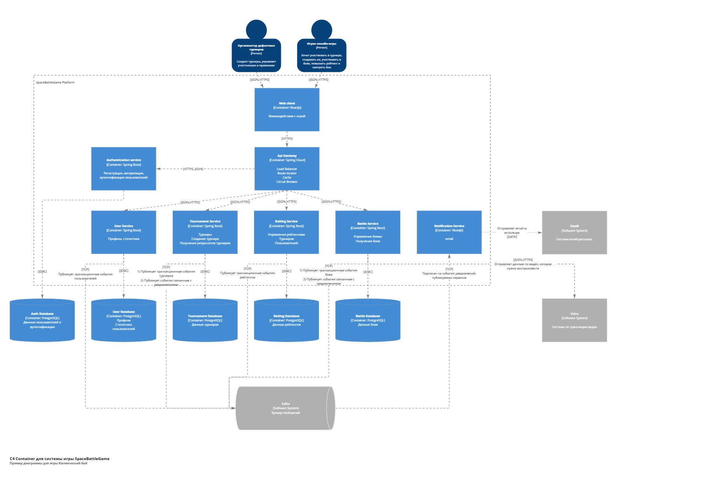
## Endpoints и взаимодействие микросервисов
### 1. Auth Service (/auth/*)
* POST /auth/register - регистрация пользователя
* POST /auth/login - вход в систему
* POST /auth/refresh - обновление токена
* POST /auth/logout - выход из системы
### 2. User Service (/users/*)
* GET /users/{id} - получение профиля
* PUT /users/{id} - обновление профиля
* GET /users/{id}/stats - статистика игрока
* GET /users/search - поиск игроков
### 3. Tournament Service (/tournaments/*)
* POST /tournaments - создание турнира
* GET /tournaments - список турниров
* GET /tournaments/{id} - детали турнира
* POST /tournaments/{id}/register - регистрация в турнир
* PUT /tournaments/{id}/status - изменение статуса турнира
### 4. Battle Service (/battles/*)
* POST /battles - создание боя
* GET /battles/{id} - информация о бое
* POST /battles/{id}/submit - отправка программы
* GET /battles/{id}/replay - получение записи боя
### 5. Rating Service (/ratings/*)
* GET /ratings/user/{id} - рейтинг пользователя
* GET /ratings/tournament/{id} - рейтинг турнира
* POST /ratings/calculate - пересчет рейтинга
* POST /ratings/create - создание рейтинга
* PUT /ratings/{id}/update - обновление рейтинга
### 6. Notification Service (/notifications/*)
* GET /notifications/ws - WebSocket для уведомлений
* POST /notifications - отправка уведомления
* GET /notifications/user/{id} - уведомления пользователя
### 7. Battle Engine (внутренний API)
* POST /engine/battle/start - запуск боя
* GET /engine/battle/{id}/status - статус выполнения
* POST /engine/validate - валидация программы агента
## Sequence Diagrams (Частично)
### 1. Полный цикл регистрации и аутентификации
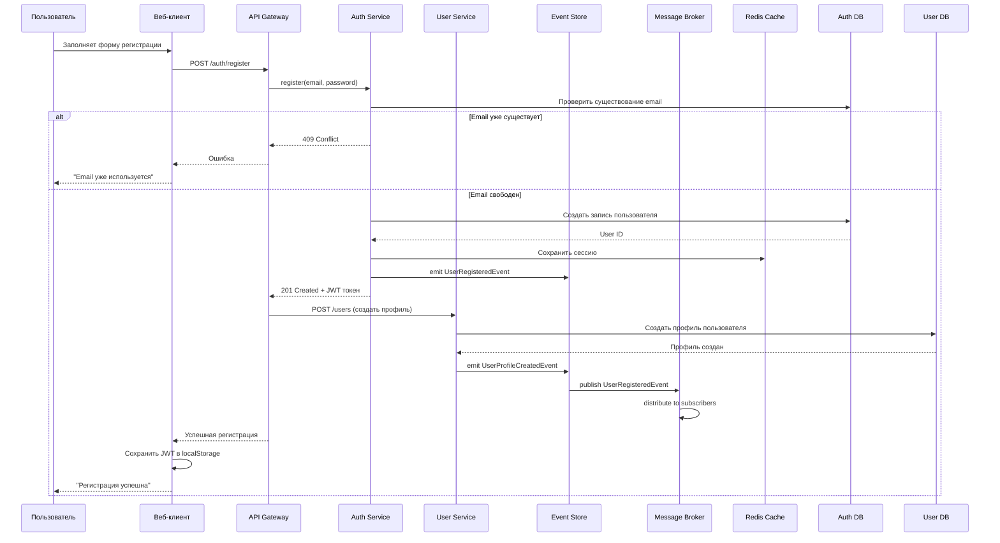
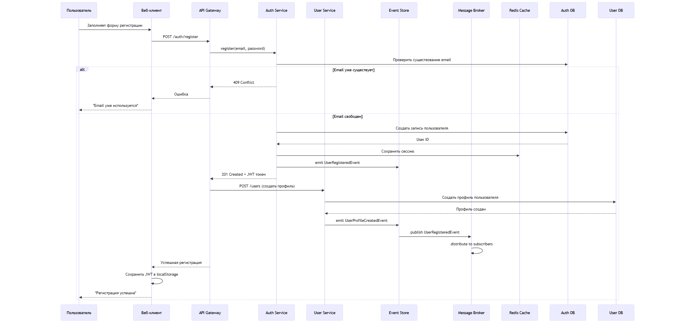
### 2. Создание турнира организатором
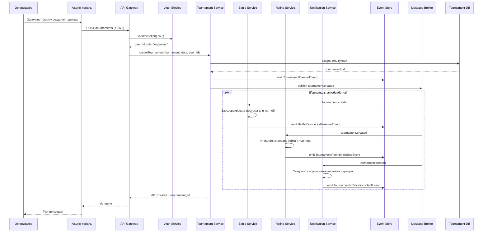
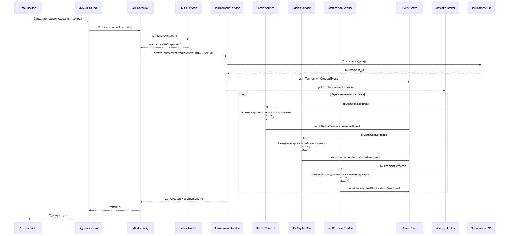
### 3. Регистрация игрока на турнир
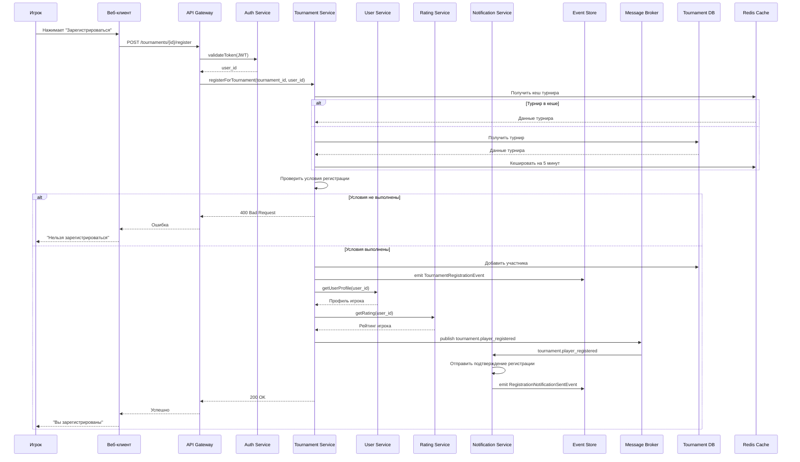
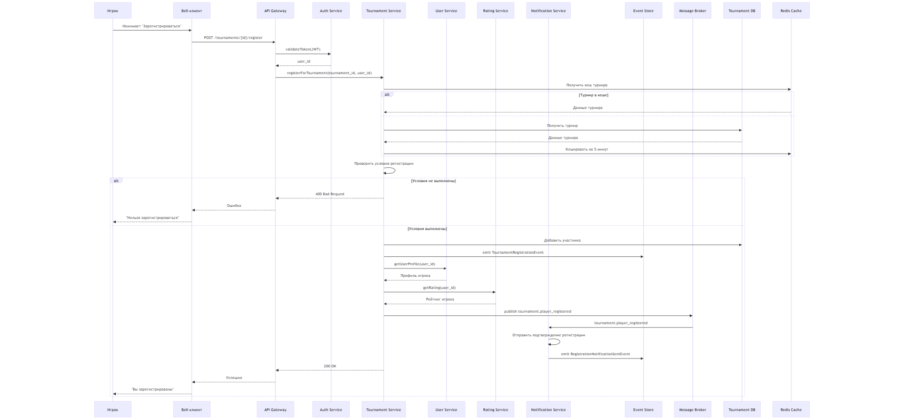
### 4. Матчмейкинг и создание боя
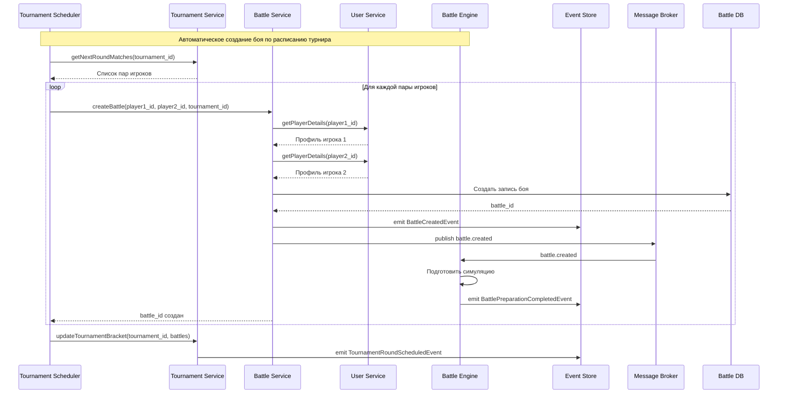
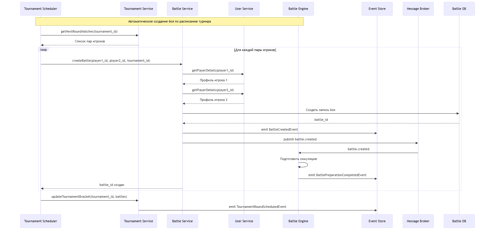
### 5. Исполнение боя в Battle Engine
```mermaid
sequenceDiagram
    participant Engine as Battle Engine
    participant Battle as Battle Service
    participant Agent1 as Agent 1
    participant Agent2 as Agent 2
    participant Rating as Rating Service
    participant Replay as Replay Service
    participant Event as Event Store
    participant Broker as Message Broker
    participant Storage as Object Storage
    participant DB_Battle as Battle DB

    Note over Engine,DB_Battle: Этап 1: Инициализация
    
    Engine->>Storage: Загрузить код агента 1
    Storage-->>Engine: Код агента 1
    
    Engine->>Storage: Загрузить код агента 2
    Storage-->>Engine: Код агента 2
    
    Engine->>Engine: Инициализировать игровое поле
    Engine->>Event: emit BattleStartedEvent
    
    Note over Engine,Engine: Этап 2: Игровой цикл
    
    loop Каждый игровой тик (1..N)
        Engine->>Agent1: executeTurn(game_state)
        Agent1-->>Engine: Действие агента 1
        
        Engine->>Agent2: executeTurn(game_state)
        Agent2-->>Engine: Действие агента 2
        
        Engine->>Engine: Применить физику и правила
        Engine->>Engine: Обновить игровое состояние
        
        alt Условие победы выполнено
            Engine->>Engine: Определить победителя
            break
        end
    end
    
    Note over Engine,Storage: Этап 3: Завершение
    
    Engine->>Engine: Сгенерировать реплей
    Engine->>Storage: Сохранить реплей
    Storage-->>Engine: replay_url
    
    Engine->>DB_Battle: Сохранить результаты
    Engine->>Event: emit BattleCompletedEvent
    Engine->>Broker: publish battle.completed
    
    Broker->>Battle: battle.completed
    Battle->>Battle: Обновить статус боя
    
    Broker->>Rating: battle.completed
    Rating->>Rating: Обновить рейтинги игроков
    
    Broker->>Replay: battle.completed
    Replay->>Replay: Обработать реплей для CDN
```
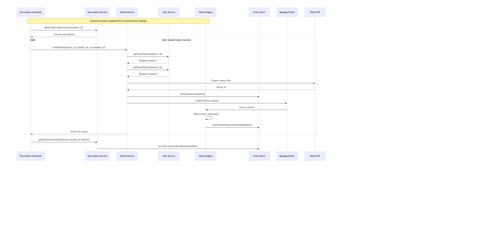
### 6. Обновление рейтинга после боя (Saga)
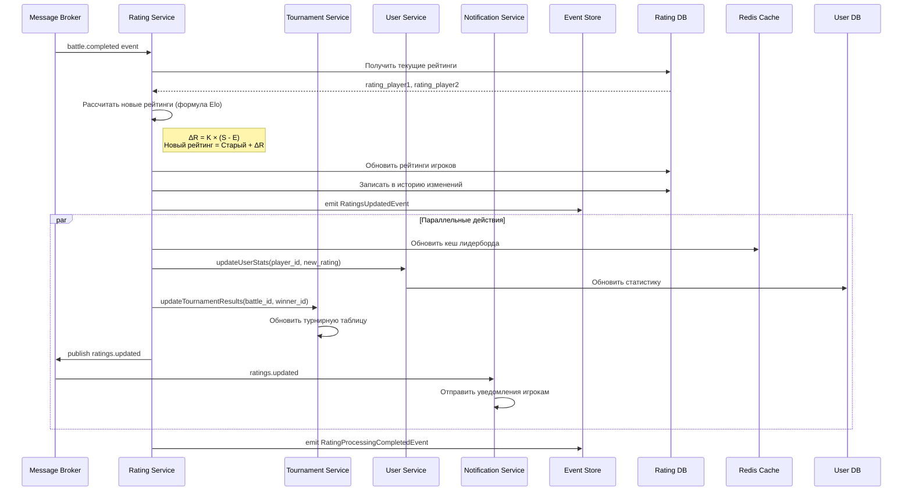
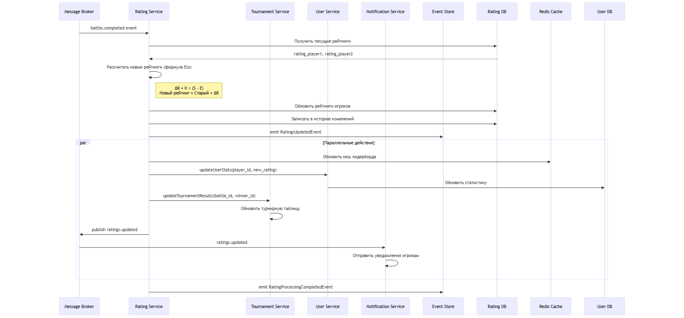
### 7. Просмотр реплея боя
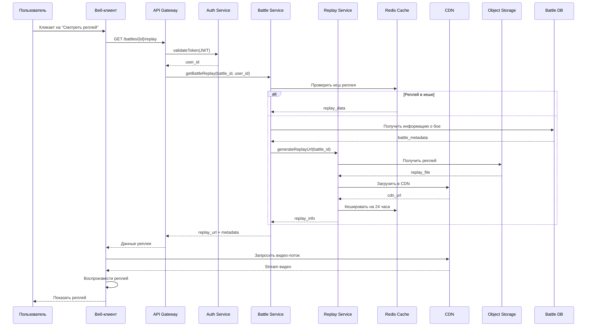
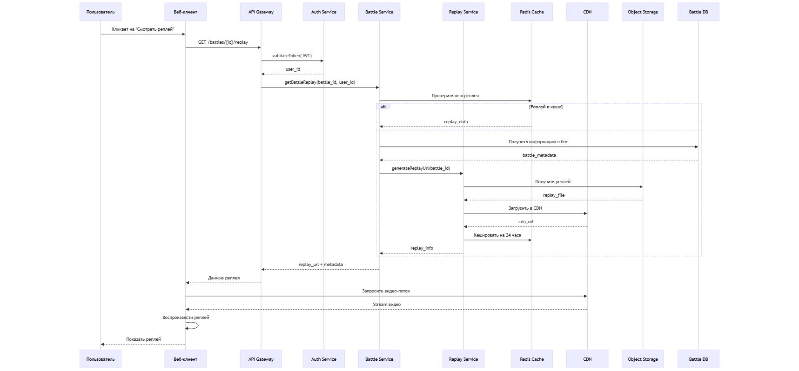
### 8. Полный турнирный цикл (Swiss система)
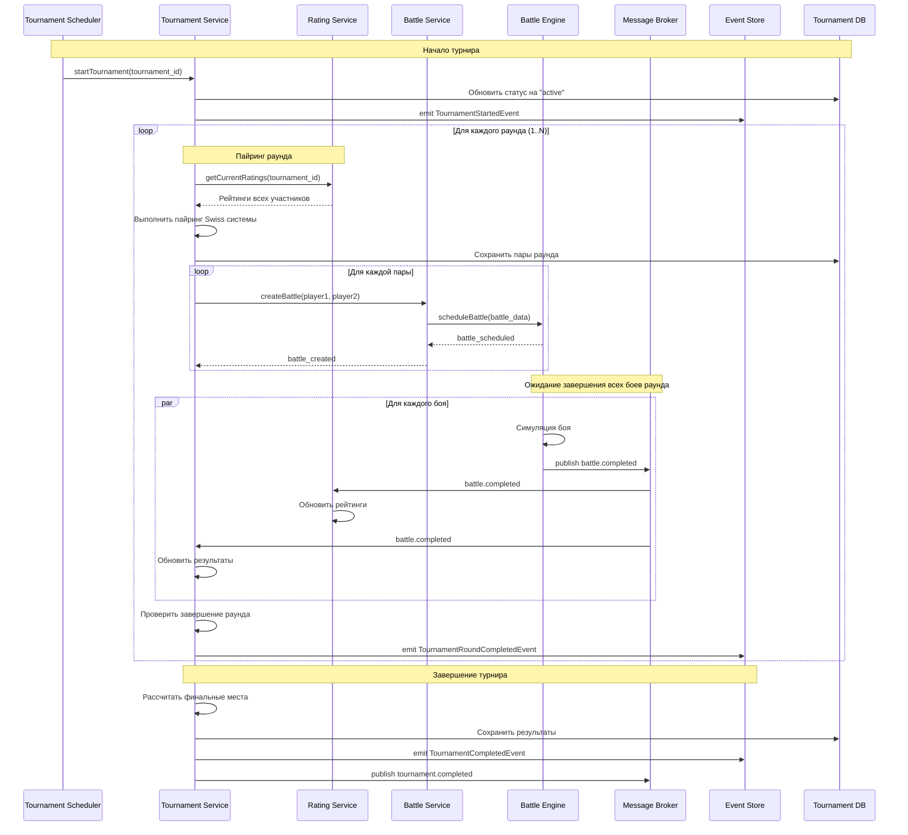
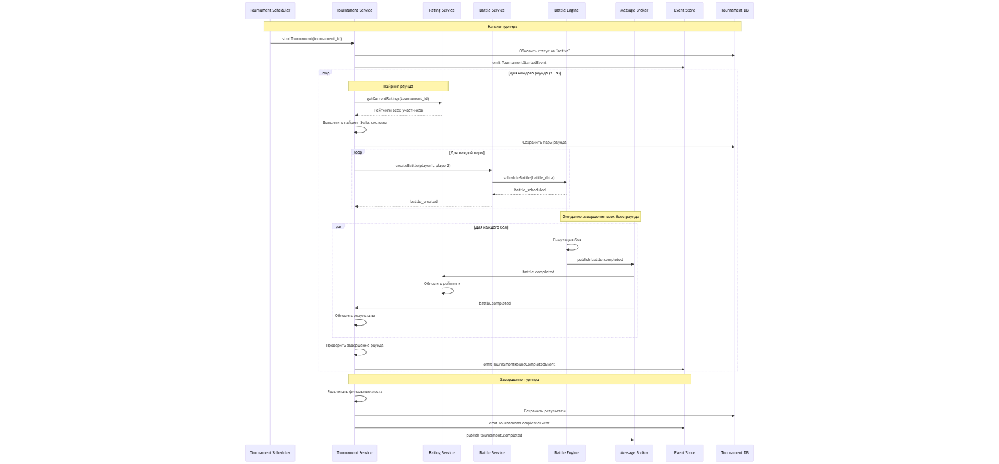
## Узкие места и проблемы масштабирования
### 1. Проблема: Нагрузка на Battle Engine
**Описание:** Игровые симуляции требуют значительных вычислительных ресурсов, особенно при массовых турнирах.</br>

**Решение:**
* Горизонтальное масштабирование Battle Engine с использованием очередей (Kafka)
* Балансировка нагрузки через Service Mesh
* Автоскейлинг на основе метрик CPU/памяти
* Кеширование результатов симуляций в Redis
### 2. Проблема: Задержки в обновлении рейтинга
**Описание:** Расчет рейтинга для регулярных турниров может создавать пиковую нагрузку.</br>
**Решение:**
* Асинхронная обработка обновлений рейтинга через Message Broker
* Пакетная обработка ночью для не-реaltime обновлений
### 3. Проблема: Хранение и отдача реплеев боев
**Описание:** Видеозаписи боев занимают много места и создают нагрузку на сеть.</br>
**Решение:**
* Использование CDN для раздачи статики
* Компрессия реплеев на лету
* Потоковая передача вместо скачивания целиком
* Хранение "горячих" реплеев в кеше, "холодных" - в S3 Glacier
* Использовать сторонний сервис

### 4. Согласованность данных между микросервисами
**Описание:** Сервисы имеют разные бд, распределенные транзакции теряют атомарность.</br>
**Решение:**
* Event Sourcing + Saga Pattern
* В сервисах добавить компенсирующие транзакции
* Получаем консистентность по итогу 

## Компоненты с часто меняющимися требованиями
### 1. Battle Engine (Игровой движок)
**Описание:** Балансировка игры, новые типы кораблей, изменение правил физики.</br>
**Решение:**
* SOLID
* Выделение интерфейсов для игровых объектов
* Использование dependency injection
* Конфигурация через JSON/YAML файлы
### 2. Rating Service (Рейтинговая система)
**Описание:** Изменение формул расчета, введение новых лиг, сезонные сбросы.</br>
**Решение:**
* SOLID
* Фабричный метод для создания калькуляторов рейтинга
### 3. Tournament Service (Турнирная система)
**Описание:** Новые форматы турниров, разные системы сеток, специальные правила.</br>
**Решение:**
* SOLID
* Абстрактный класс Tournament с шаблонными методами
* Конкретные реализации для разных форматов
* Система правил как отдельный компонент
## Описание решения
Разработанная микросервисная архитектура для игры "Космический бой" разделяет систему на 7 основных сервисов, каждый из которых отвечает за определенную бизнес-область:

1. Сервисы ядра (Auth, User, Tournament) обеспечивают базовую функциональность приложения.
2. Игровой движок (Battle Engine) выделен в отдельный сервис для изоляции ресурсоемких операций. (Должен быть описан в c4 модели в компонентах)
3. Вспомогательные сервисы (Rating, Notification) реализуют дополнительные функции.

### Ключевые архитектурные решения:
* API Gateway служит единой точкой входа, обеспечивая аутентификацию, лимиты запросов и маршрутизацию.
* Message Broker позволяет асинхронное взаимодействие между сервисами, уменьшая связность, транзакции.
* Разделение баз данных - каждый сервис управляет своей схемой данных.
* * Разделение кешей - некоторые сервисы используют кеш.
### Преимущества подхода:
* Масштабируемость: Каждый сервис можно масштабировать независимо.
* Устойчивость к отказам: Падение одного сервиса не приводит к остановке всей системы.
* Гибкость разработки: Команды могут работать над разными сервисами независимо.
* Технологическая гетерогенность: Возможность использовать разные языки/технологии для разных сервисов.
### Недостатки и компромиссы:
* Сложность развертывания: Требуется orchestration (Kubernetes).
* Сложность входа
* Сетевая задержка: Межсервисные вызовы добавляют latency.
* Сложность отладки: Требуется распределенная трассировка.
### Рекомендации по внедрению:
* Начать с монолита, выделяя сервисы по мере необходимости.
* Использовать feature flags для постепенного развертывания изменений.
* Внедрить comprehensive мониторинг с самого начала.
* Использовать contract testing для обеспечения совместимости API.
* Данная архитектура обеспечивает баланс между гибкостью, производительностью и сложностью поддержки, позволяя системе эволюционировать вместе с требованиями к игре.